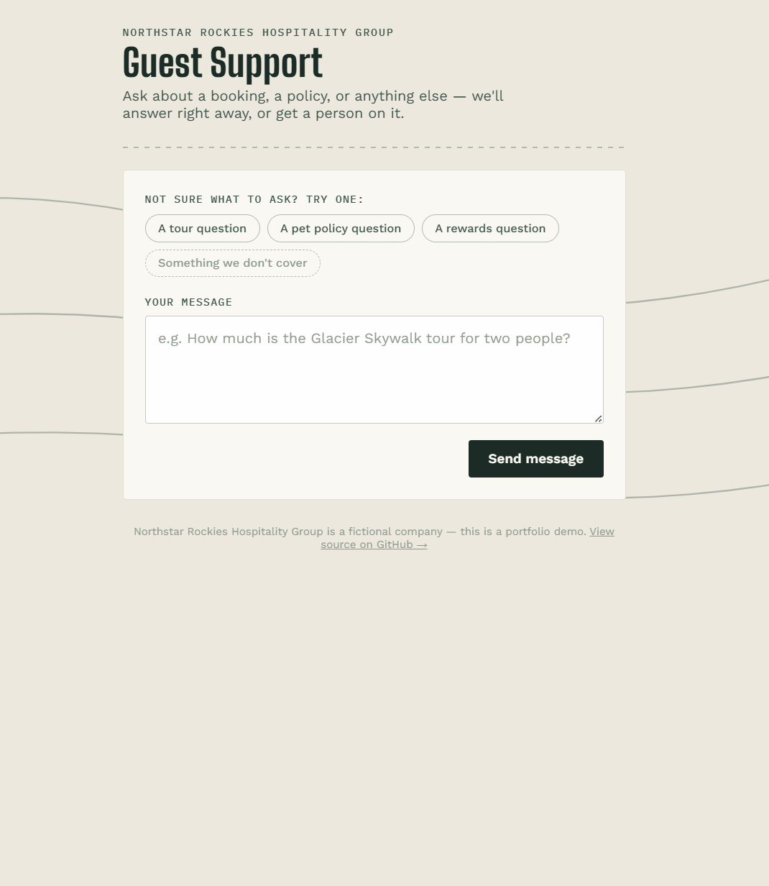

# Ticket Triage & Knowledge Assistant

🔗 **[Live demo](https://ticket-triage-agent-aky4.onrender.com/)** (free hosting — first load may take ~10-20 seconds to wake up)



An AI agent that triages hospitality support tickets: reads a full knowledge
base, decides whether it can confidently answer or needs a human, and either
drafts a cited reply or escalates with a specific reason. Built end-to-end
with the Claude API and deployed live, not just running locally.

**What this demonstrates:**
- Agentic tool-calling with Claude — the agent decides *whether* to answer
  or escalate, not just what to say
- Prompt injection resistance, verified with live automated tests against
  real attack patterns, not just asserted in a comment
- A real architectural pivot (retrieval → full-context) backed by measured
  data, with the reasoning documented, not hidden
- A GitHub-API-backed CMS solving a real hosting constraint (ephemeral
  filesystem on free tier) without needing a database
- A genuine correctness bug — a rate limiter that would've silently
  counted every visitor as one shared client behind a proxy — caught and
  fixed before it shipped, documented with the reasoning below

Built as a portfolio project modeled on real tourism/hospitality-ops support
workflows: classify → retrieve → resolve or escalate.

## Status
✅ Live and deployed — see the demo link above. Architecture and full
build log, including real bugs found and fixed along the way, below.

## Scope (MoSCoW)

**Must have**
- Knowledge base docs covering Northstar's main business lines
- Agentic tool-calling loop (Claude reads the full KB as context, then
  decides: `draft_reply` or `escalate`)
- Sample ticket set covering happy-path, ambiguous, and out-of-scope cases
- CLI runner showing it end-to-end
- BM25 search module, built and tested — but not on the live agent path,
  see "Retrieval architecture" below for why

**Should have**
- ✅ FastAPI wrapper (`api.py`) exposing the same agent as `POST /tickets`,
  sharing one core function with the CLI (separation of concerns — the
  agent logic shouldn't know or care how it was invoked)
- ✅ Deliberate prompt-injection test tickets (T-004, T-005) + dedicated
  guardrail tests (`tests/test_guardrails.py`)
- ✅ Escalation reasoning shown in output, not just a black-box flag
- ✅ Basic tests for search and for KB cross-reference integrity
  (`check_references.py`)
- This README, documenting decisions and trade-offs as they're made

**Could have**
- ✅ Guest ticket web UI (`static/index.html`) — single page, anonymous,
  served directly by `api.py`. Deliberately does not show the guest raw
  `escalation_reason` or `cited_docs` (those are written for internal
  reviewers) — shows either the actual answer or a warm "a person will
  follow up" message instead.
- ✅ Admin/CMS interface (`auth.py`, `github_kb.py`, `admin/cms.html`) —
  view and edit existing KB docs, committed straight to GitHub, gated
  behind HTTP Basic auth. Built in three tested stages after being
  deliberately deferred once (auth → persistence → UI) — see "CMS /
  knowledge base management" below for the full build, including the
  security reasoning and the honest limitations (no add/delete docs,
  no real logout, ~1-2 min publish delay).
- Re-enabling retrieval (BM25 or an embeddings upgrade) once the KB
  outgrows full-context inclusion — see "Scalability path" below
- Model tiering (Haiku for triage, Sonnet for complex replies)

**Won't have**
- Real production ticket volume/infra — the 300-500/week figure is client
  flavor, not a target this repo is built to handle
- Real integration with an actual booking/PMS system
- Live weather/wildfire data feed — KB docs stay static, edited by hand
- Multi-tenant/auth system

## Architecture

```
ticket text
    |
    v
agent.py: triage_ticket()
    - builds a system prompt = instructions + the ENTIRE knowledge base
      (all 8 docs, ~2,200 tokens - see "Retrieval architecture" below)
    - sends ticket + system prompt to Claude (Haiku 4.5) with two tools
    - forces a tool call (tool_choice: "any") - Claude must decide
    |
    +-- draft_reply(reply, category, cited_docs)  -> TriageResult(resolved)
    |
    +-- escalate(reason, category)                -> TriageResult(escalated)

Two entry points call this same function - neither duplicates its logic:

    main.py  -- CLI, loops over data/sample_tickets.json, prints results
    api.py   -- FastAPI, POST /tickets, same function, HTTP in/out
```

`search.py` and `check_references.py` exist alongside this but are not
called by `triage_ticket()` - they're the scale-ready retrieval layer,
documented in "Retrieval architecture" and "Scalability path" below.

`triage_ticket(ticket_text: str) -> TriageResult` is a single pure
function with no knowledge of ticket metadata (id, channel, etc.) or of
how it was invoked - that's what lets the CLI and API share one core
without duplicating agent logic (see Design decisions).

## Setup

```bash
pip install -r requirements.txt -r requirements-dev.txt
cp .env.example .env        # then add your real ANTHROPIC_API_KEY to .env
python -m pytest tests/     # runs without needing an API key at all
python check_references.py  # validates KB cross-links

# guardrail tests (prompt injection) need a real key and cost a tiny
# real amount - not part of the free suite above, run explicitly:
python -m pytest tests/test_guardrails.py -v

# try the agent for real (needs a real API key in .env):
python agent.py "Hi, I want to book the Glacier Skywalk excursion for 4 people next Friday. How much will that cost?"

# or run the whole sample ticket set at once:
python main.py

# or run it as an HTTP API instead:
uvicorn api:app --reload
# then open http://127.0.0.1:8000 in a browser for the guest ticket UI,
# or http://127.0.0.1:8000/docs for the interactive API docs
```

## CMS / knowledge base management (in progress)

Deferred earlier once, now being built deliberately, in three tested
stages rather than all at once: auth first, then persistence (via
committing straight to GitHub, since Render's free tier is ephemeral),
then the actual CMS page.

**Stage 1 — auth (done).** `auth.py`: a single shared username/password,
read from `CMS_USERNAME`/`CMS_PASSWORD` env vars, checked with
`secrets.compare_digest` rather than `==` (prevents a timing attack -
see the module docstring for why that distinction is real, not
theoretical caution). `GET /cms` is a real FastAPI route, not a static
file — gating it there (not just the API calls under it) is what makes
the browser's native login prompt appear on first page load. Test it
locally:
```bash
# add CMS_USERNAME and CMS_PASSWORD to your .env first
uvicorn api:app --reload
# then visit http://127.0.0.1:8000/cms - browser should prompt for login
```

**Stage 2 — persistence (done).** `github_kb.py`: reads and writes KB
docs via GitHub's Contents API instead of local disk, which is the
actual fix for Render's ephemeral filesystem. Two things worth knowing:

- **The filename whitelist is the security boundary, not just a
  feature limit.** `list_valid_doc_filenames()` only allows filenames
  that already exist in `knowledge_base/` locally — this is what rules
  out path traversal (`../../etc/passwd`-style attacks), by
  construction, not by trying to sanitize a filename after the fact.
  This falls directly out of the earlier "edit-only, no add" scope
  decision — the security boundary and the feature boundary are the
  same line here, not two separate things.
- **No custom locking was built for concurrent edits — GitHub's own
  `sha` mechanism handles it for free.** Every update must include the
  doc's current `sha` (from a prior read); GitHub rejects the write
  (409) if someone else changed it first. `update_doc_content` catches
  that specific case and raises a clear "someone else already changed
  this, reload and try again" error instead of a generic failure.

Test it locally (no server needed - this exercises the real GitHub API
directly):
```bash
python -c "from github_kb import get_doc_content; d = get_doc_content('pet-policy.md'); print(d.sha); print(d.content[:100])"
```

**Stage 3 — CMS page (done).** `admin/cms.html`, served only through the
`GET /cms` route (never through the public `static/` mount — deliberately
kept in a separate directory so it's unreachable any other way). Simple
list → click → edit → save flow against `github_kb.py`. Two things worth
noting:

- **No custom "log out."** HTTP Basic has no real session to end
  server-side — the page says so plainly rather than faking a button
  that wouldn't actually do anything. Closing the browser is the only
  real way to end the session.
- **The "1–2 minute delay" caveat is shown directly in the UI**, not
  just in this README — someone using the CMS live shouldn't have to
  read documentation to understand why their edit isn't visible on the
  guest site instantly.

Test it locally end to end:
```bash
uvicorn api:app --reload
# visit http://127.0.0.1:8000/cms, log in, click a doc, edit, save -
# then check the repo on GitHub for a new real commit
```

## Deploying (Render)

The API and guest UI are one service (the UI is served as static files
by `api.py` itself — see Architecture), so this is a single deploy:

1. Push this repo to GitHub (already done for this project).
2. On [render.com](https://render.com): New → Web Service → connect the
   GitHub repo.
3. Build command: `pip install -r requirements.txt`
4. Start command: `uvicorn api:app --host 0.0.0.0 --port $PORT --proxy-headers`
   (the `--proxy-headers` flag matters, not just style — see "Rate
   limiting" below for why)
5. Add an environment variable: `ANTHROPIC_API_KEY` = your real key
   (Render's dashboard, not committed to the repo — same reason `.env`
   is gitignored locally).
6. Deploy. First request after any period of inactivity will be slow
   (free tier spin-down) - that's expected, not a bug.

Note: this deploys the guest UI only. The knowledge base files are part
of the repo, not user-editable at runtime - see "Could have" above for
why a live-editable CMS is deliberately not part of this deploy.

## Rate limiting

`POST /tickets` is limited to 10 requests/minute per client (only this
endpoint - it's the one with real per-call cost; `/health` and the
auth-gated `/cms` routes aren't limited).

**A real correctness bug got caught before this shipped, worth recording
precisely.** `slowapi`'s default IP-detection (`get_remote_address`) has
a documented bug — it checks for a header key that doesn't actually
match how proxies send it, so it silently never finds it and falls back
to `request.client.host`. Behind *any* reverse proxy (which Render is),
that fallback returns the **proxy's** IP, not the visitor's — meaning
every visitor would get bucketed under the same shared limit. Worst
case: one person's traffic exhausts the limit, and it silently breaks
the guest UI for every other visitor at once. That's a worse failure
mode than having no rate limiter at all.

**The actual fix lives at the server layer, not in application code:**
uvicorn's own `--proxy-headers` flag correctly populates
`request.client.host` with the real client IP before our code ever sees
the request. Our own key function (`get_client_ip` in `api.py`) just
reads that directly — no header-parsing of our own to get wrong. This
is *why* the Render start command above includes that flag; it's load
-bearing, not decorative.

**Honest limitation, stated rather than hidden:** this doesn't defend
against a client that spoofs its own IP-related headers directly — a
real hardened setup would also restrict which upstream hosts are
trusted to set forwarding headers at all. Not built here, since the
[Anthropic Console spend limit](https://platform.claude.com) already
set on this project is the actual backstop against runaway cost — the
rate limiter is a second, complementary layer against everyday
nuisance traffic, not the sole defense.

On Windows cmd, the only line that differs is `copy .env.example .env`
instead of `cp` - everything else is identical.

## Design decisions

**Knowledge base delivery: full-context inclusion, not retrieval — at this
scale.** The entire knowledge base measures 1,600 words / ~2,200 tokens
across 8 docs (measured, not estimated). Small enough to include directly
in every prompt, which eliminates the ranking problem entirely — there's
no "wrong doc" to retrieve if Claude reads the complete text of all of
them every time. Made cost-effective by Claude's prompt caching, designed
for exactly this pattern: large, static, repeatedly-reused context. A full
BM25 module (`search.py`) was built and tested first; see "Retrieval
architecture" below for why it's not what powers the live agent, and
"Scalability path" for when that would change.

**Decision logic: agentic tool-calling loop, not single structured
output.** Claude gets `draft_reply` and `escalate` as tools and decides
which to call based on whether the full knowledge base — given directly
in context — actually contains enough to answer confidently. This is the
real "agent" skill (judgment over available information, including
knowing when *not* to answer), not classification with extra formatting.

**Knowledge base freshness: files are re-read on every search, not cached
in memory.** At 8 small markdown files there's no performance cost to this,
and it avoids a real bug class (serving stale content after an update
because an in-memory copy wasn't invalidated). Would need revisiting at
real scale, but is free correctness here.

**KB maintenance: markdown files edited directly, for this demo only.** In
a real deployment, non-technical client staff would need to update prices
and policies without touching git or markdown syntax — that's the CMS/admin
interface noted under Could have. AI assistance for drafting content is a
reasonable enhancement to that interface later, but a human owning and
approving what gets published is the assumed default, not a fully
autonomous AI-maintained knowledge base.

## Retrieval architecture: built, tested, and deliberately not the live path

A full BM25 keyword-search module (`search.py`) was built first, against
all 8 knowledge base docs. Testing surfaced two genuine precision bugs
along the way — both confirmed through diagnostics, not assumed:

1. **Cross-reference leakage.** Disclaimer notes written for human readers
   (e.g. "vacation rentals have a separate policy, see X.md") leaked the
   referenced doc's vocabulary into the source doc — BM25 can't tell
   "mentions X to rule it out" from "mentions X because it's relevant."
   Fixed by moving cross-references into a `## See Also` section, stripped
   before indexing but still shown to the agent when it reads a doc.
2. **Topical dilution.** Even after that fix, a narrowly-scoped doc (the
   hotel refund policy — 100% about cancellation) structurally out-scores
   a broader multi-topic doc (vacation rental policies, where cancellation
   is one section among several) on cancellation-related queries. This is
   a known limitation of whole-document BM25 generally, not a bug specific
   to this implementation — chunking by section is the real fix, and was
   evaluated and deliberately not built (see below).

Both are documented precisely: `check_references.py` validates `## See
Also` links point to real files, and `tests/test_search.py` has
regression tests against the exact queries that first exposed each bug.

**Then the scale question got asked, and it changed the answer.** The
entire knowledge base measures 1,600 words / ~2,200 tokens, total, across
all 8 docs. Small enough to include directly in every prompt — which
eliminates the ranking problem completely, since there's no "wrong doc"
to retrieve if Claude reads the full, actual text of all of them every
time. This is made cost-effective by Claude's prompt caching, which is
designed for exactly this pattern: large, static, repeatedly-reused
context checked on every incoming ticket.

**So `search.py` stays in the repo, fully built and tested, but the live
agent uses full-context inclusion instead.** This isn't abandoning
precision — it's choosing the simpler, more accurate approach for the
actual measured scale of the problem, after empirically finding exactly
where the more complex approach's precision breaks down first.

## Scalability path

The right architecture depends on scale *and shape*, not just "the KB got
bigger." Three distinct tiers:

**Tier 1 — where this repo is now.** Single tenant (Northstar), ~2,200
tokens total. Full-context inclusion + prompt caching. Retrieval has
nothing meaningful to add at this size.

**Tier 2 — Northstar grows organically.** More properties, more service
lines, more edge-case policies, still one client. Once the KB crosses
roughly 20-30K tokens, or document count grows into the dozens with real
topical overlap (more docs competing for words like "cancellation" — the
exact pattern found and fixed above), that's the signal to revisit
retrieval. Not because the context window can't hold it, but because
relevance ranking starts mattering again at that density. `search.py` is
built, tested, and ready for this transition.

**Tier 3 — acquisition by a much larger chain.** A different *shape* of
problem, not a bigger version of Tier 2. Nobody wants every property's
policies in every ticket's context regardless of window size — the real
need is a **routing layer**: which brand, property, or region does this
ticket even belong to? If tickets carry reliable metadata (property ID,
brand tag), that's simple filtering, no ML required. Retrieval only
re-enters the picture *within* the correctly-scoped subset, and only if
that subset is itself large — a two-layer architecture (route, then
retrieve), not a single bigger index.
